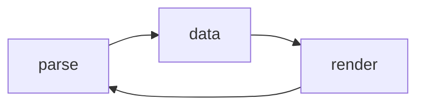

# Coordz - Geographische Koordinaten

Eine kleine JS-Bibliothek zum Einlesen von Geo-Koordinaten.

## Koordinaten

Gemeint sind Breiten- und Längengrade, mit denen sich eine Position auf der Erdoberfläche beschreiben lässt. 

Sie dienen der Ortsbestimmung.

Im Grunde wird ein Gitternetz über die Erdkugel gelegt, und dort werden wie in einem Koordiatensystem die Werte auf den Achsen abgelesen. 

Der Breitengrad geht dabei von Norden (90°) bis nach Süden (-90°), und der Längengrad von Osten (180°) bis Westen (-180°). 

So kann man jeden Punkt auf einer Kugeloberfläche lokalisieren, wobei wir natürlich wissen, dass die Erde keine geometrische Kugel ist. 

Der Breitengrad 0 wäre der Äquator, und der Längengrad 0 liegt bei Greenwich. 

Ein Grad unterteilt sich in 60 Minuten, und eine Minute in 60 Sekunden. Das sind Winkeleinheiten.

***Kleines Einmaleins:***

|Deutsh|Englisch|Abk.|
|-|-|-|
|Breite|Latitude|lat|
|Länge|Longitude|lon|
|Grad|Degrees|°|
|Minuten|Minutes|'|
|Sekunden|Seconds|"|
|Norden|North|N|
|Osten|East|E|
|Süden|South|S|
|Westen|West|W|

Die übliche Schreibweise ist `dd°mm'ss.s"H`, also Grad, Minuten, Sekunden und Himmelsrichtung.

Bei der Angabe von Breiten- und Längengrad, schreibt man die Breite zuerst.

Die Koordinaten für das Brandenburger Tor in Berlin wären `52°30'58.4"N, 13°22'41.8"E`. 

Das könnt ihr mal auf Google Maps oder Bing Maps suchen. 

Dort müsste auch noch eine zweite Schreibweise auftauchen `52.516222, 13.378278`.

Im Kontextmenu findet sich auch diese Angabe.

Hier hat man die Minuten und Sekunden nach Grad umgerechnet und zeigt nur die Gradzahl an.

`52°30'58.4" = 52 + (30 / 60) + (58.4 / 3600) = 52.516222°`

Wenn man keine Himmelsrichtung angibt, dann kann die Zahl auch negativ sein, um die Richtung zu unterscheiden.

<pre>
            (90°)
              N
              |
(-180°) W ----+---- E (180°)
              |
              S
            (-90°)
</pre>

Mit Himmelsrichtung sind diese immer positiv.

|mit|ohne|
|-|-|
|52°N|52°|
|52°S|-52°|
|52°E|52°|
|52°W|-52°|


## Datenbasis

Dreh- und Angelpunkt ist eine 32-Bit Ganzzahl mit Vorzeichen (int32). 

Alle Eingaben werden in dieses Format übertragen und in eine IData-Struktur gemappt.

`5230584 <-> IData <-> 52°30'58.4"N`



***Daten laden***
```typescript
// from ERP (5230584) -> data(N)
const lat: IData  = Coordz.data(5230584);

// hemisphere
lat.H = lat.N < 0 ? 'S' : 'N';

// 52°30'58.4"N
input.value = Coordz.render('dd°mm\'ss.s"H', lat);
```

***Daten lesen***
```typescript
// from input (52°30'58.4"N) (can have more than one result)
const result: IData[] = Coordz.parse(input.value);

// default data(0)
const lat: IData = result[0] || Coordz.data(0);

// 5230584
console.log(lat.N)
```

Die Felder werden auch zur Formatierung genutzt.

***IData-Struktur***
| Feld   | Beschreibung         | Wert                                      | `52°30'58.4"N` | `52°30'58.4"S`  |
| -      | -                    | -                                         | -              | -               |
| d      | Degrees Part         | unsigned                                  | `52.5162223`   | `52.5162223`    |
| m      | Minutes Part         | unsigned                                  | `30.9733334`   | `30.9733334`    |
| s      | Seconds Part         | unisgned                                  | `58.4`         | `58.4`          |
| n      | Number Full          | unsigned                                  | `5230584`      | `5230584`       |
| D      | Degrees Full         | signed                                    | `52.5162223`   | `-52.5162223`   |
| M      | Minutes Full         | signed                                    | `3150.9733334` | `-3150.9733334` |
| S      | Seconds Full         | signed                                    | `189058.4`     | `-189058.4`     |
| N      | Number Full          | signed                                    | `5230584`      | `-5230584`      |
| H      | Cardinal Point       | `N`<br>`E`<br>`S`<br>`W`                  | `N`            | `S`             |
| T      | Type                 | `Latitude`<br>`Longitude`<br>`Unspecified`| `Latitude`     | `Latitude`      |
| lat    | Convert to Latitude  | function                                  | -              | -               |
| lon    | Convert to Longitude | function                                  | -              | -               |
| render | Render Value         | function                                  | -              | -               |

## Formatierung

> Alle Ausgaben die mit einem Großbuchstaben beginnen, und keine Himmelsrichtung beinhalten, können als sicher betrachtet werden.
> Das bedeuted, diese können über die `parse()`-Funktion wieder korrekt eingelesen werden.

Vorzeichenbehaftete Angaben stellen den kompletten Wert dar.

> Wenn eine Himmelsrichtung angegeben wurde, dann darf keine vorzeichenbehaftete Formatierung genutzt werden.
> Dies würde sonst unter Umständen das Ergebnis umkehren.

***Beispiel***

| Format         | Ausgabe          | Eingabe / Parse | Anmerkung    |
| -              | -                | -               | -            |
| `d.ddddd°`     | `52.51622°`      | -               | unzureichend |
| `m.mmmmm'`     | `30.97333'`      | -               | unzureichend |
| `s.sssss"`     | `58.40000"`      | -               | unzureichend |
| `dd°mm'ss.s"`  | `52°30'58.4"`    | -               | unzureichend |
| `D.ddddd°`     | `-52.51622°`     | sicher          | komplett     |
| `M.mmmmm'`     | `-3150.97333'`   | sicher          | komplett     |
| `S.sssss"`     | `-189058.40000"` | sicher          | komplett     |
| `DD°mm'ss.s"`  | `-52°30'58.4"`   | sicher          | komplett     |
| `dd°mm'ss.s"H` | `52°30'58.4"S`   | sicher          | komplett     |
| `DD°mm'ss.s"H` | `-52°30'58.4"S`  | -               | Umkehrung    |
| `dd°m.mmm'`    | `52°30.973'`     | unspecified     | unzureichend |
| `DD°m.mmm'`    | `-52°30.973'`    | sicher          | komplett     |
| `n`            | `5230584`        | n/a             | -            |
| `N`            | `-5230584`       | n/a             | data(N)      |
| `H dd°mm'ss.s"`| `S 52°30'58.4"`  | sicher          | komplett     |
| `H dd mm ss.s` | `S 52 30 58.4`   | sicher          | Reihenfolge  |
| `H DD mm ss.s` | `S -52 30 58.4`  | -               | Umkehrung    |
| `DD mm ss.s`   | `-52 30 58.4`    | sicher          | Reihenfolge  |

Darüber hinaus alle sinnvollen Kombinationen der entspr. Felder oder eine der vordefinierten Konstanten.

```typescript
Coordz.Format.Default // dd°mm'ss.s"H
Coordz.Format.Degrees // D.ddddd°
Coordz.Format.Minutes // M.mmmmm'
Coordz.Format.Seconds // S.sssss"

// 1. short way
// as latitude (type and hemisphere)
var text = Coordz.data(-5230584).lat().render();

// 52°30'58.4"S
console.log(text);

// 2. long way
// set hemisphere manually
var lat = Coordz.data(-5230584);
lat.H   = lat.N < 0 ? 'S' : 'N';
lat.T   = Coordz.DataType.Latitude;

// to string
var text = Coordz.render('dd°mm\'ss.s"H', lat);

// 52°30'58.4"S
console.log(text);
```

## Eingaben

Mit der `parse()`-Funktion können Eingaben eingelesen werden.

Eine Koordinate besteht aus zwei Werten (Breiten- und Längengrad).

Die `parse()`-Funktion liefert kein Koordinatenpaar sondern eine x-beliebige Anzahl von Werten.

Zur Abgrenzung müssen die Angaben durch ein Komma getrennt werden.

```typescript
const result: IData[] = Coordz.parse('52.516222');

// length 1
console.log(result.length);

const result: IData[] = Coordz.parse('52.516222, 13.378278');

// length 2
console.log(result.length);

const result: IData[] = Coordz.parse('52.516222, 13.378278, 52°30\'58.4"S');

// length 3
console.log(result.length);
```

***Beispiel ein Eingabefeld***

```typescript
const result: IData[] = Coordz.parse('52.516222, 13.378278');

const lat: IData = (result[0] || Coordz.data(0)).lat();
const lon: IData = (result[1] || Coordz.data(0)).lon();

// 52°30'58.4"N
console.log(lat.render());

// 13°22'41.8"E
console.log(lon.render());

// Pseudocode
// {lat: 5230584, lon: 1322418}
post backend {lat: lat.N, lon: lon.N}

// Pseudocode
// {lat: 52.516222, lon: 13.378278}
post backend {lat: lat.D, lon: lon.D}
```

***Beispiel zwei Eingabefelder***
```html
<input id="latInput">
<input id="lonInput">

<script>
var latInput = document.getElementById("latInput");
var lonInput = document.getElementById("lonInput");

var lat = (Coordz.parse(latInput.value) || Coordz.data(0)).lat();
var lon = (Coordz.parse(lonInput.value) || Coordz.data(0)).lon();

// Pseudocode
post backend {lat: lat.N, lon: lon.N}
</script>
```

## `data(N)` vs. `combine(D, M, S)`

Dreh- und Angelpunkt in dieser Implementierung ist die `data(N)`-Funktion.

Diese ist nicht zum Verarbeiten von Benutzereingaben gedacht.

Die Funktion dient zum Einlesen von Daten aus dem Backend (Datenbank, REST-API).

Erwartet wird eine vorzeichenbehaftete 32-Bit Ganzzahl `N` nach dem Schema `ddmmsss`.

```typescript
// Pseudocode
// coord = {lat: 5230584, lon: 1322418}
get_data_from_backend('Berlin').then(coord => {
  const lat: IData = Coordz.data(coord.lat).lat();
  const lon: IData = Coordz.data(coord.lon).lon();

  // 52°30'58.4"N
  console.log(lat.render());

  // 13°22'41.8"E
  console.log(lon.render());
});
```

Sollte die Daten in einem anderen Format vorliegen, so müssen diese nach N umgewandelt werden.

Die `combine()`-Funktion kann dies bewerkstelligen.

`N = combine(D: number, M: number, S: number)`

***Beispiel***
```typescript
// D, M, S
N = 5230584 = Coordz.combine(52, 30, 58.4)

// Grad
N = 5230584 = Coordz.combine(52.516222)

// Minuten
N = 5230584 = Coordz.combine(0, 3150.97333)

// Sekunden
N = 5230584 = Coordz.combine(0, 0, 189058.4)

// Rechnen + 110 Minuten
N = 5420584 = Coordz.combine(52, 30 + 110, 58.4)

// 54°20'58.4"N
console.log(Coordz.data(N).lat().render())
```

```typescript
// Pseudocode
// coord = {lat: 52.516222, lon: 13.378278}
get_data_from_backend('Berlin').then(coord => {
  // convert to lat = 5230584, lon = 1322418
  const latN: number = Coordz.combine(coord.lat);
  const lonN: number = Coordz.combine(coord.lat);

  const lat: IData = Coordz.data(latN).lat();
  const lon: IData = Coordz.data(lonN).lon();

  // 52°30'58.4"N
  console.log(lat.render());

  // 13°22'41.8"E
  console.log(lon.render());
});
```

## Skripte, Module & Co

Je nach Anwendung greift euch ein Skript der Wahl und kopiert es in den eigenen Ordner.

Am Besten das Typescript aus dem source-Ordner.

Typescript
- source/coordz.ts

Ein paar Skripte wurden bereits zum Testen transpiliert.

Module
- dist/module/coordz.js

Wenn es schnell und einfach klassisch im Browser laufen soll (IIFE).

Browser
- dist/legacy/coordz.js

```html
<script source="legacy/coordz.js">
 // Global
var lat = Coordz.data(5230584).lat();
</script>
```

Der debug-Ordner ist nur zum Testen, den solltet ihr nicht nehmen. Man reinschnüffeln, alles gut, Beispiele sind auch dort.

Es gibt noch ein coordz.legacy.ts, aber die Datei ist nur zum Erzeugen von dist/legacy/coordz.js, könnt ihr auch ignorieren. Das ist die coordz.ts, nur halt ohne export.

***Beispiel Verwendung mit RequireJS***

```html
<script src="require.min.js"></script>
<script src="amd/coordz.js"></script>

<script>
  // named module "coordz"
  require(["coordz"], function(coordz) {
    // exported Coordz from named module coordz
    var Coordz = coordz.Coordz;
    var lat = Coordz.data(5230584).lat();
});
</script>
```
***Beispiel import***

```typescript
// not so funny
import * as coordz from './coordz';
var lat: coordz.Coordz.IData = coordz.Coordz.data(5230584).lat();

// better
import {Coordz} from './coordz';
var lat: Coordz.IData = Coordz.data(5230584).lat();

// maybe
import {Coordz as geo} from './coordz';
var lat: geo.IData = geo.data(5230584).lat();
```
